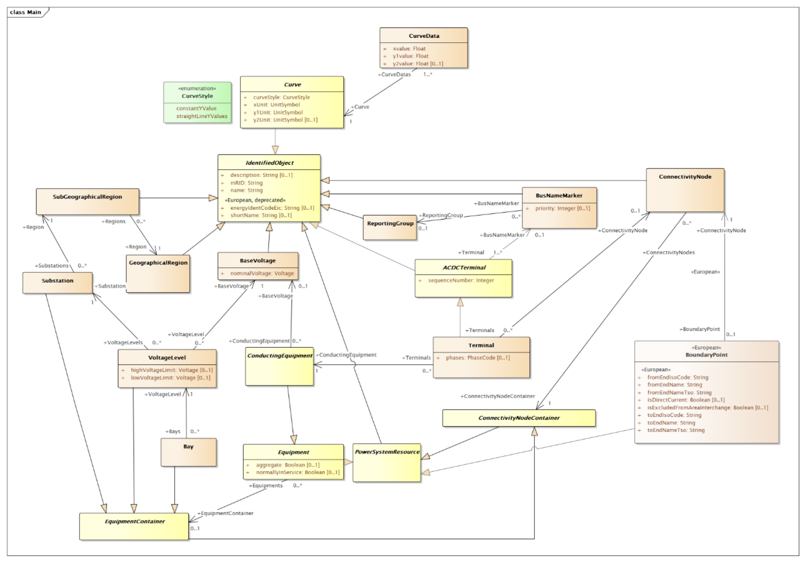

# About the Core Equipment Vocabulary

This part defines the IEC 61970-450-series and IEC 61968-13 related profiles
that are included in CGMES. It includes the references to published standards
and additional constraints defined to the relevant standard. If the relevant
edition of a standard is not published, it also includes the profile definition
and the standard’s constraints.

There are various levels at which an exchange of power system data/models is
necessary. A pan-European model exchange level covers the territory of all
system operators (TSOs and DSOs). Regional model exchanges can be realised
between different TSOs in one or more synchronous areas. A model exchange on
the national level includes interfaces between TSOs (in case there are multiple
TSOs on a national level) as well as between different DSOs.

The purpose of model exchanges is not only to exchange the data from one
authority to another but also to satisfy the ultimate goal, namely, to perform
common studies using shared data. All parties involved in the process should be
able to perform the same types of studies and share project tasks between
different parties which are using different power system analysis applications.
Indeed, the interoperability between different applications used in the
exchange process is therefore crucial in both reaching seamless data exchange
and obtaining comparable study results when using this data. The CGMES covers
these European and system operators (TSOs and DSOs) business processes by
defining the following main types of exchanges valid for a particular study or
process:

* Exchange of boundary set: An exchange of a boundary Set is necessary to
  prepare an exchange of an internal system operator model and to merge a
  common grid model. E.g. the ENTSO-E Network Modelling Database (NMD) is used
  to maintain the Boundary Set covering the pan-European area where all TSOs
  negotiate and agree on the boundary information.
* Exchange of an internal TSO model, i.e. individual grid model (IGM2): A
  number of business processes require each TSO to provide models of its
  internal territory. To describe its internal territory in a single
  stand-alone exchange, a TSO is treated as a single model authority set and
  shall be able to exchange datasets complying with profiles defined in the
  CGMES. The TSO prepares its internal model in such a way that it is easily
  and unambiguously combined with other TSO internal models to make up complete
  models for analytical purposes. This type of exchange can also be applied for
  the interface between a TSO and a DSO, where models covering transmission or
  distribution parts of the power system can be exchanged based on a mutual
  agreement between the TSOs and the DSOs. In this case, and if a TSO requests
  a DSO model, the DSO would provide its model in accordance with CGMES
  definitions.
* Exchange of a common grid model: A common grid model refers to the concept of
  having one model which can be used for multiple purposes. The specification
  describes what is needed to create a merge model of multiple TSOs' Individual
  Grid Models (IGM) of their responsible territory into a regional or
  pan-European model. Various business processes will require specific
  implementation of the profiles part of the CGMES and the exchange of
  respective instance files to meet interoperability inside the business
  process. The Common Grid Model meta-model description will ensure
  interoperability across the business process.

Business processes (e.g. system development planning, protection planning,
operational planning, operation, fault study/simulation, market operation,
etc.) are, of course, more complex than these operations, but what is important
to note is that all processes are supported using only these basic kinds of
interoperation. In addition, business processes shall define or precise, where
necessary, the content of the data exchange within the scope of the defined
profiles. For instance, OperationalLimitSet can be used to constraint any
conducting equipment. It is up to the business process to define if any
equipment is mandatory to have operational limits. Note that each power system
model normally consists of multiple datasets (distribution) as defined in CIM
standards and further specified by CGMES.

The CGMES supports node-breaker (NB) and bus-branch (BB) model exchanges.
